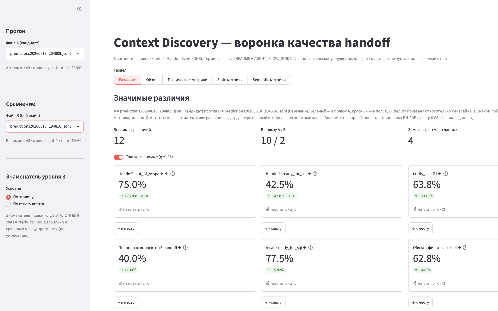
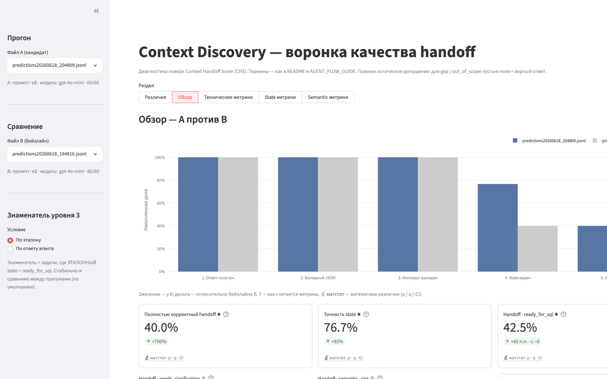
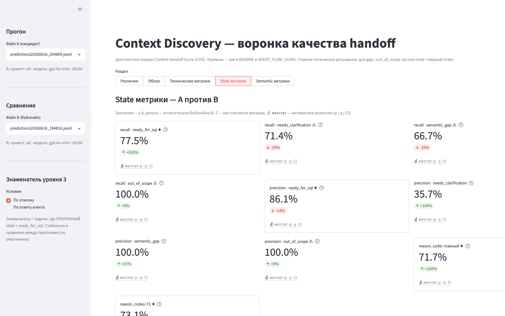

# AI Analyst — бенчмарк этапа Context Discovery

Бенчмарк и инструменты диагностики для MVP **Context Discovery** продукта `AI Analyst`: аналитик задаёт бизнес-вопрос, агент готовит из `Semantic Layer` пакет контекста (домен, метрики, источники, сущности, фильтры, `state`) для черновика SQL под ревью человека.

## Коротко: что это такое

- **Задача агента.** По вопросу аналитика вернуть строгий JSON-контракт: `domain_id`, `metric_ids`, `sources`, `entity_ids`, `required_filters`, `state`, `reason_codes`, `evidence`. Агент **не пишет SQL** и не отвечает на вопрос — он только готовит контекст и честно решает, можно ли идти дальше.
- **Данные бенчмарка.**
  - `data/tasks.jsonl` — 60 вопросов аналитиков.
  - `data/golden.jsonl` — эталонные ответы (ground truth).
  - `data/semantic_layer.json` — справочник домена: допустимые id метрик/источников/сущностей и обязательные фильтры. Источник истины для проверки «не выдумал ли агент сущности».
- **Четыре класса `state`:** `ready_for_sql`, `needs_clarification`, `semantic_gap`, `out_of_scope`. Для `semantic_gap` / `out_of_scope` правильный ответ — **пустые поля контекста** (агент не должен навязывать SL).
- **Две системы оценки + дашборд:**
  1. **CHS** (`src/evaluate.py`) — релизный KPI из 4 компонентов (как было).
  2. **Воронка качества handoff** (`src/funnel_metrics.py`) — новая диагностическая метрика и главный показатель «handoff верен целиком».
  3. **Streamlit-дашборд** (`src/dashboard.py`) — интерактивная диагностика с режимом сравнения двух прогонов.

---

## Что нового в этой версии

Акцент этого релиза — три изменения: **улучшенный системный промпт**, **новая KPI-метрика (воронка handoff)** и **дашборд со сравнением прогонов**.

### 1. Улучшенный системный промпт (`v3`)

В `src/pipeline.py` три версии промпта (`--system-prompt v1|v2|v3`):

| Версия | Что добавлено | CHS | Полностью корректный handoff | Точность `state` |
|--------|---------------|-----|------------------------------|------------------|
| `v1` (baseline) | минимальный промпт, всегда `ready_for_sql`, выбор метрик «по словам» | **0.52** | ~0 | — |
| `v2` | строгий JSON без markdown, 4 класса `state`, запрет выдумывать метрики | **0.78** | 0.05 (3/60) | 0.40 |
| `v3` (текущий) | роль Context Discovery, полный JSON-контракт, `entity_ids`, приоритет решений, allowed `reason_codes`, правила работы с SL | **0.88** | **0.40 (24/60)** | **0.77** |

Главные идеи `v3`: явная **иерархия решений** (policy → semantic gap → clarification → контекст → `state`), запрет `ready_for_sql` «на догадке», разделение «слова в вопросе ≠ id метрики», обязательная проверка `required_filters` предагрегированных витрин.

### 2. Новая KPI-метрика: воронка качества handoff

CHS усредняет 4 компонента и может быть «в норме», даже когда целиком корректных ответов мало. Воронка отвечает на прямой вопрос: **в какой доле задач пакет контекста верен целиком?**

- **5 стадий (накопленные AND-гейты):** `Ответ получен → Валидный JSON → Контракт валиден → State верен → Контекст верен`. Первые три — настоящая воронка выживаемости (технический контракт), последние две — решение и контекст.
- **Три уровня метрик:**
  - **Технические метрики** — сервис ответил, JSON валиден, нет выдуманных id.
  - **State метрики** — классификация по 4 классам: confusion-матрица, precision/recall/F1 по классам, `reason_codes`.
  - **Semantic метрики** — точность полей контекста (домен, метрики, источники, сущности, обязательные фильтры) на задачах с эталоном `ready_for_sql`.
- **Главный показатель — «Полностью корректный handoff»:** доля задач, прошедших все 5 стадий (строгий AND). Для `semantic_gap` / `out_of_scope` пустые поля засчитываются как верный ответ. Дополнительно метрика разбивается **по сегментам эталонного `state`**.

### 3. Интерактивный дашборд + режим сравнения

`src/dashboard.py` (Streamlit + Plotly) на русском, с подсказками по каждой метрике. Ключевая возможность — **сравнение двух прогонов** (например, `v3` против `v2`):

- двойной набор метрик с акцентом на **статистически значимых** различиях;
- значимость считается **парным bootstrap** по разностям на общей популяции задач (для precision-метрик с плавающим знаменателем — непарный bootstrap), с поправкой на множественность **Benjamini–Hochberg (FDR)**;
- зелёный — различие в пользу прогона **A** (кандидата), красный — в пользу **B** (бейзлайна); сортировка по относительной величине эффекта;
- вкладка **«Различия»** перечисляет только значимые отличия с переходом к месту метрики;
- значок **`?`** объясняет, как считается метрика, а отдельный значок **`🔬 матстат`** прячет под hover математику различия (`p`, `q`, доверительный интервал, несогласные пары) — чтобы не загромождать дашборд.

#### Сравнение `v3` и `v2` на дашборде

Вкладка «Различия» (A = `v3`, B = `v2`): 12 значимых различий, 10 — в пользу `v3`.



Раздел «Обзор»: воронка `v3` (синий) против `v2` (серый) — видно, что `v3` гораздо реже теряет задачи на стадиях `State верен` и `Контекст верен`.



Раздел «State метрики»: разбор классификации `state` по классам.



---

## Как запускать

### Установка

```bash
python3 -m venv .venv && source .venv/bin/activate
pip install -r requirements.txt
```

Ключи LLM (`OPENAI_API_KEY`, `OPENAI_BASE_URL`) уже лежат в `.env` в корне репозитория — после клонирования настраивать ничего не нужно.

### 1. Генерация ответов (inference)

`src/pipeline.py` прогоняет задачи через LLM и пишет предсказания в `outputs/predictions{timestamp}.jsonl` (рядом — `.meta.json` с версией промпта, моделью и ошибками). В конце прогон **сам печатает CHS**.

```bash
# текущий промпт v3 (по умолчанию)
python3 src/pipeline.py

# конкретная версия промпта
python3 src/pipeline.py --system-prompt v3
python3 src/pipeline.py --system-prompt v2     # бейзлайн для сравнения

# быстрый прогон на 15 задачах
python3 src/pipeline.py --system-prompt v3 --limit 15

# свой путь вывода
python3 src/pipeline.py --system-prompt v3 --output outputs/my_run.jsonl
```

### 2. Оценка (CHS)

```bash
# оценить конкретный прогон
python3 src/evaluate.py --predictions outputs/predictions20260618_204809.jsonl
```

Выводит 4 компонента, итоговый `context_handoff_score`, статус относительно порога staging (CHS ≥ 0.95) и «Фокус улучшения» — самый слабый компонент.

### 3. Дашборд (Streamlit)

```bash
streamlit run src/dashboard.py
# откроется http://localhost:8501
```

В сайдбаре выберите **Файл A (кандидат)**; чтобы включить **режим сравнения**, дополнительно выберите **Файл B (бейзлайн)**. Дашборд автоматически подхватывает все файлы `outputs/predictions*.jsonl`.

> Чтобы было что сравнивать, сделайте минимум два прогона с разными `--system-prompt` (например, `v3` и `v2`).

---

## Context Handoff Score (CHS) — методика

**CHS** измеряет, насколько надёжно агент **передаёт аналитику контекст** для следующего шага, а не «угадывает ответ за него». Это не «идеальность SQL», а качество передачи эстафеты. Четыре компонента с равным весом (по 25%) закрывают четыре разных продуктовых риска.

| Компонент | Что измеряет | Риск, который закрывает |
|-----------|--------------|--------------------------|
| `operational_reach` | доля задач с ответом в ожидаемом JSON-формате | пайплайн недоступен / падает |
| `confirmed_path_alignment` | на эталонных `ready_for_sql` агент тоже ставит `ready_for_sql` | типовые задачи тормозятся лишними уточнениями |
| `undefined_task_conservatism` | на неопределённых задачах не врёт уверенным `ready_for_sql` с выдуманным контекстом | опасный ложный SQL-ready (safety) |
| `mcp_contract_compliance` | ответ — валидный контракт (`state`, `reason_codes`, `domain_id`) | downstream не может разобрать ответ |

`undefined_task_conservatism` — частичные баллы: `state` как в эталоне → 1.0; `ready_for_sql` без метрик/источников → 0.7; `ready_for_sql` с подставленным контекстом → 0.0.

Одна метрика «accuracy по всем полям» была бы честнее по качеству, но не отражала бы **приоритеты релиза**. Поэтому при доработке смотрите, какой из четырёх рисков вы закрываете, и не оптимизируйте один компонент ценой другого без явного trade-off. Подробные определения компонентов и примеры — в истории git и в `src/evaluate.py`.

Эталонная процедура агента (без привязки к доменам кейса) — в `AGENT_FLOW_GUIDE.md`; конкретные метрики и правила — в `data/semantic_layer.json`.

---

## Структура репозитория

```text
.env, .env.example
data/tasks.jsonl            # 60 вопросов
data/golden.jsonl           # эталонные ответы
data/semantic_layer.json    # справочник домена (допустимые id, обязательные фильтры)
src/pipeline.py             # генерация ответов (inference), промпты v1/v2/v3
src/evaluate.py             # CHS (релизный KPI)
src/funnel_metrics.py       # воронка handoff + метрики по уровням + сравнение
src/compare.py              # парный bootstrap, BH-FDR, расчёт значимых различий
src/dashboard.py            # Streamlit-дашборд (одиночный режим + сравнение)
outputs/                    # predictions{timestamp}.jsonl + .meta.json
docs/img/                   # скриншоты дашборда
AGENT_FLOW_GUIDE.md         # эталонная процедура агента
requirements.txt
```

## Модель и бюджет

Модель `gpt-4o-mini` через proxy API. Полный прогон 60 задач: ~150–300 ₽.
